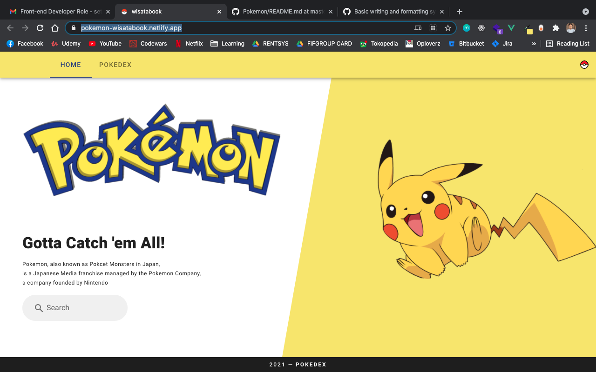
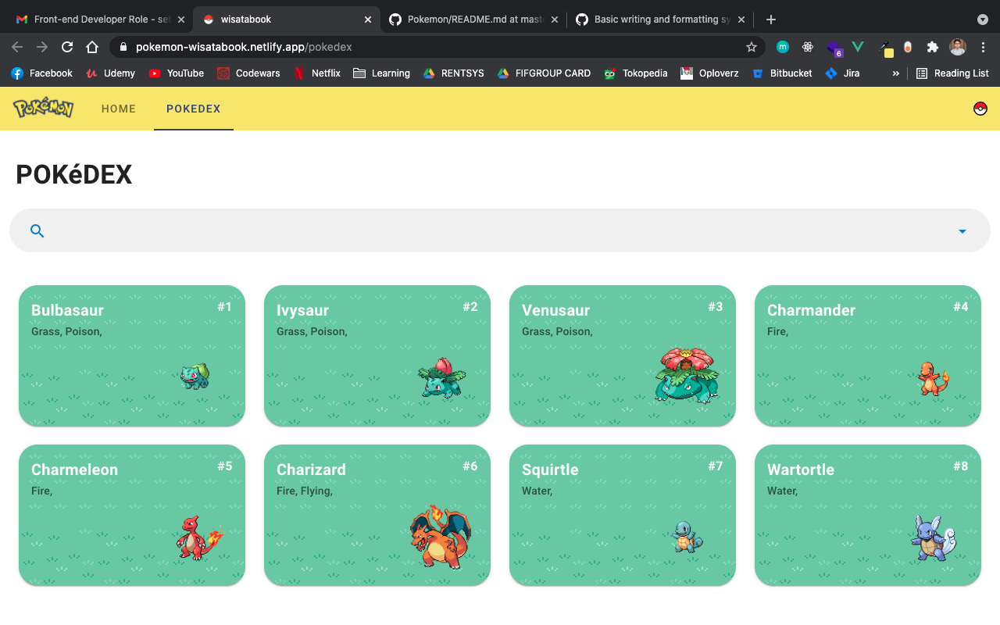
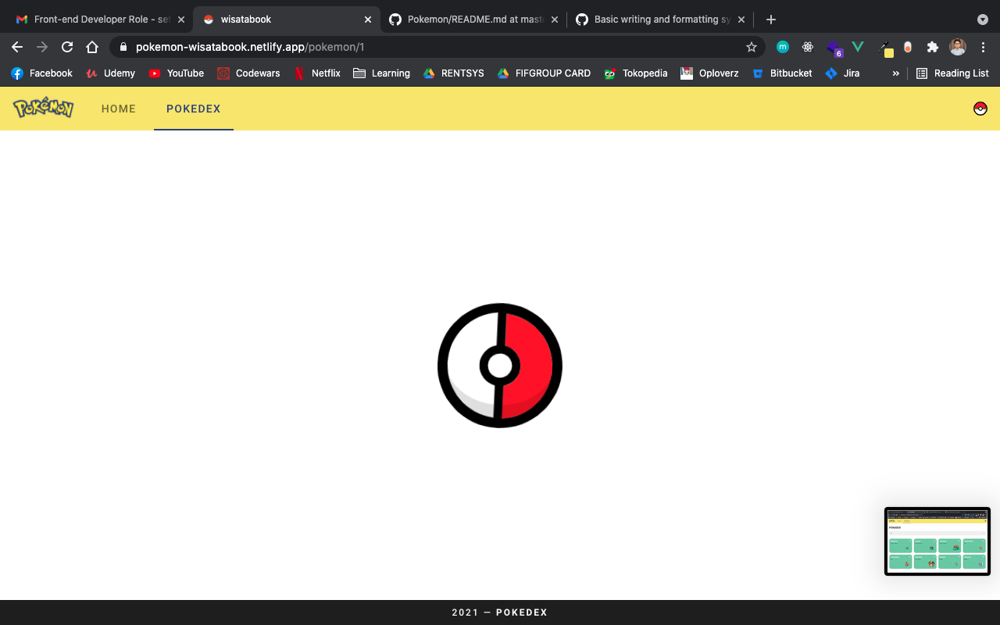
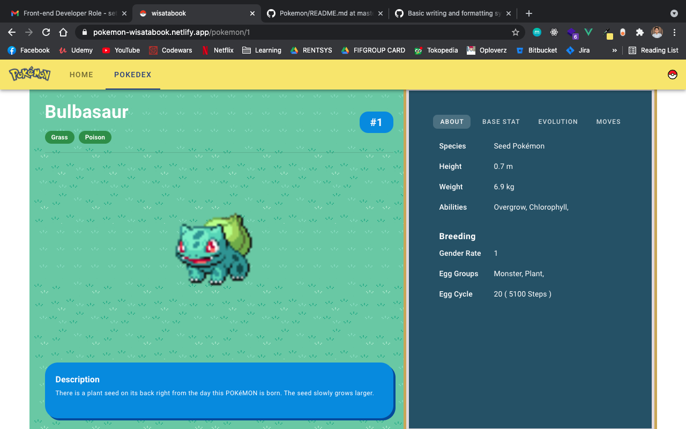
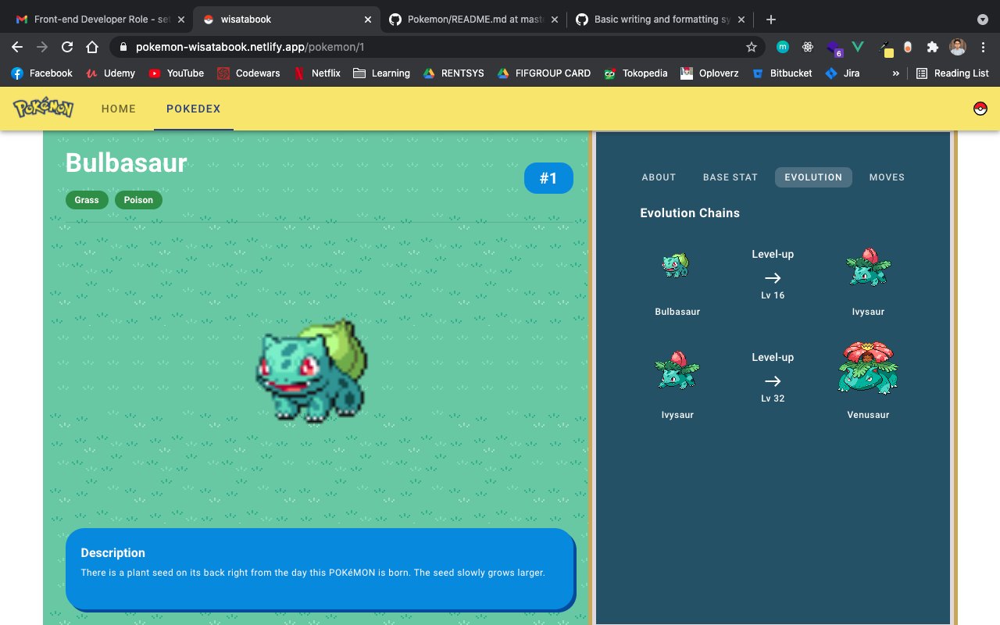
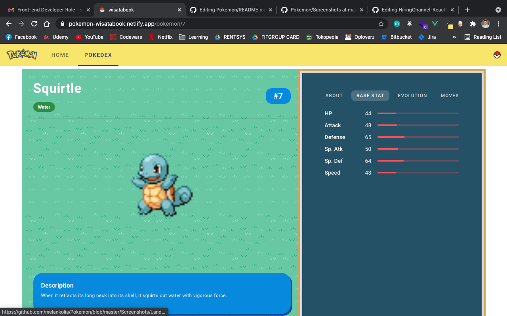

# Pokemon Wisatabook

  <image align="center" width="80" src='./src/assets/logo.svg' />

  Built with <b>Vue</b> and <b>Vuetify</b>

## Table of Contents
- [Introduction](#Introduction)
- [Live Demo](#Live-Demo)
- [Screenshots](#Screenshots)
- [Contributors](#Contributors)

## Introduction
Pokedex, using data from [PokeAPI](https://pokeapi.co/)

## Features
- Search with autocomplete functionality, i.e. type "Char" will suggest and filter "Charmander", "Charizard"
- Pokemon page details, containing:
  Pokemon data, moves, stats. etc, and 
  Link to the Evolution Pokemon page, i.e. Charmander will have link to "Charmeleon" and "Charizard"

## Screenshots

  
  
  
  
  
  

## Live Demo 
You can see the Live Demo Web 
Here [https://pokemon-wisatabook.netlify.app/](https://pokemon-wisatabook.netlify.app/)

## Technologies
- Vue
- VueX
- Vuetify
- Axios

## Contributors

  <table>
    <tr>
      <td align="center">
         
        <a href="https://github.com/melankolia">
          <b>Ageng Setyo Nugroho</b>
        </a>
      </td>
    </tr>
  </table>

